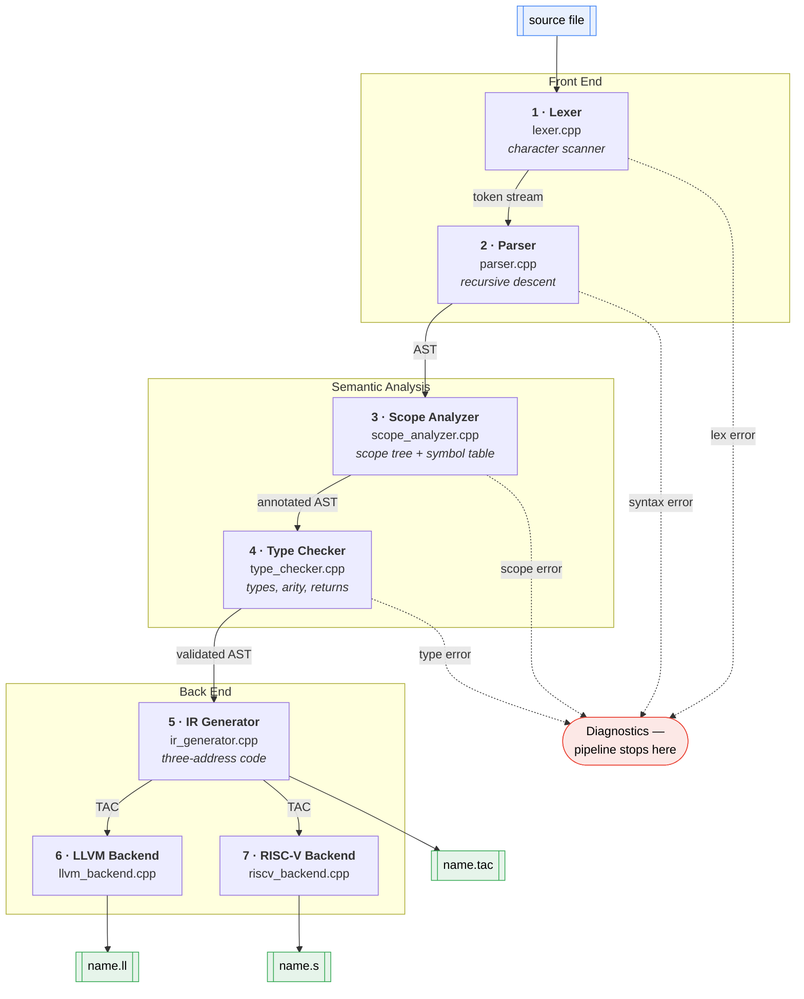
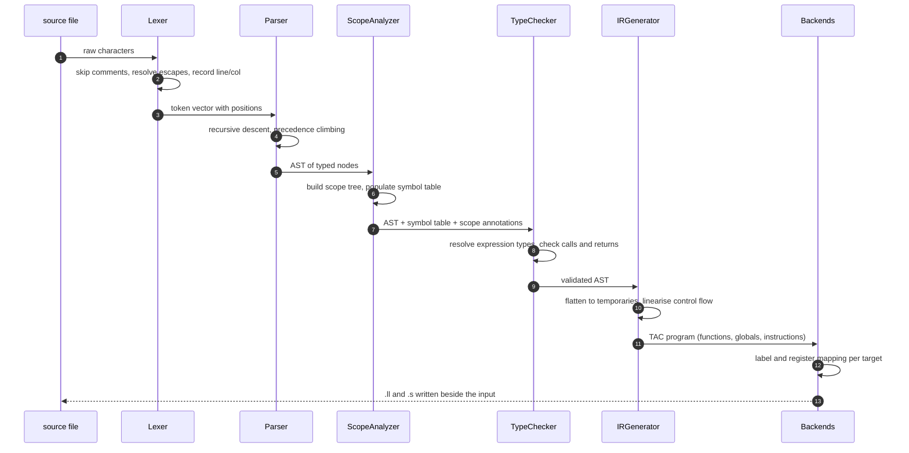

# A Compiler, End to End


**Source text in, real assembly out — every stage written by hand, no parser generator, no LLVM library.**

---

## What This Is

A complete compiler for a small imperative language, built from first principles in
C++17. It takes a source file and carries it through all seven classical stages:
characters become tokens, tokens become a syntax tree, the tree is checked for scope
and type errors, and the validated tree is lowered to three-address code and then
emitted as both **textual LLVM IR** and **RISC-V RV32IM assembly**.

Nothing here is generated. There is no flex, no bison, no ANTLR, and no linking
against libLLVM — the `.ll` output is written as text by `llvm_backend.cpp`. The point
was to understand each stage by having to make every decision inside it, so the code
is written to be read.

The repository also contains a **second lexer** built on `std::regex`, kept
side-by-side with the hand-written one so the two approaches can be compared on the
same input.

## Capabilities

- **Seven-stage pipeline** — lexing, parsing, scope analysis, type checking, TAC
  generation, LLVM IR emission, RISC-V emission — each stage independently inspectable
- **Hand-written recursive-descent parser** producing a typed AST, with precedence
  climbing for expressions
- **Real scope analysis** — a scope tree with global, function and block levels, a
  symbol table, and detection of undeclared use, redefinition, and calls to undefined
  functions
- **Full type checker** — assignment compatibility, call arity and argument types,
  return-type agreement, operator operand rules, and implicit conversions
- **Two backends from one IR** — the same three-address code lowers to LLVM IR and to
  RV32IM assembly
- **Fail-fast staging** — a stage runs only if the previous one produced no errors, so
  a single scope mistake never cascades into a screenful of bogus type errors
- **Zero dependencies** — a C++17 compiler is the only requirement
- **Two lexer implementations** — hand-rolled character scanner vs `std::regex`

## At a Glance

| | |
|---|---|
| Language | C++17 |
| Source lines | ~7,600 across 18 translation units |
| Pipeline stages | 7 |
| Largest stage | Parser — 1,632 lines |
| Backends | LLVM IR (`.ll`), RISC-V RV32IM (`.s`) |
| External dependencies | none |
| Build | a single `g++` command |

## Architecture



Each stage is a gate. If the lexer throws, nothing downstream runs; if scope analysis
reports an error, type checking is skipped; if type checking fails, no IR is emitted.
That is deliberate — reporting type errors against a tree with unresolved symbols
produces noise rather than information.

### What each stage hands to the next



### Why both backends go through TAC

Both backends consume the same three-address code rather than walking the AST
directly. Emitting LLVM IR straight from a tree is briefly simpler, but it means every
new target re-implements control-flow flattening, temporary allocation and
short-circuit expansion. Doing that once in `ir_generator.cpp` is why the RISC-V
backend is a 260-line file instead of a second compiler.

## Language Features

| Category | Supported |
|---|---|
| Types | `int`, `float`, `string`, `bool`, `char`, `void` |
| Declarations | variables, functions with typed parameters, `include` |
| Control flow | `if` / `elif` / `else`, `for`, `while`, `do`, `switch` / `case` / `default` |
| Jumps | `return`, `break`, `continue` |
| Operators | arithmetic, comparison, logical, bitwise, shifts, compound assignment |
| I/O | `print`, `read` |
| Literals | integer, float, string, char with escapes, `true` / `false` / `null` |
| Comments | `//` line and `/* */` block |

The grammar is written out in [`Non_Regex/BNF_GRAMMAR.md`](Non_Regex/BNF_GRAMMAR.md).

## Repository Layout

```
Non_Regex/                  The compiler (hand-written scanner)
  lexer.{h,cpp}             Character-by-character tokeniser, escapes, positions
  token.{h,cpp}             Token type and printing
  parser.{h,cpp}            Recursive-descent parser, AST definitions
  scope_analyzer.{h,cpp}    Scope tree, symbol table, scope diagnostics
  type_checker.{h,cpp}      Type resolution and semantic diagnostics
  ir_generator.{h,cpp}      Three-address code generation
  llvm_backend.{h,cpp}      Textual LLVM IR (.ll) emission from TAC
  riscv_backend.{h,cpp}     RV32IM GNU assembly (.s) emission from TAC
  main.cpp                  Driver: runs and reports all seven stages
  BNF_GRAMMAR.md            Grammar reference
  *_README.md               Per-stage design notes
Regex/                      Alternative std::regex lexer, same token stream
tests/                      Valid programs and one file per error class
COMPILER_SUMMARY.md         Stage-by-stage design walkthrough
```

## Build

The only requirement is a C++17 compiler.

```bash
git clone https://github.com/Husnaiin/Compiler-.git
cd Compiler-
mkdir -p build

g++ -std=c++17 -O2 \
  Non_Regex/lexer.cpp \
  Non_Regex/token.cpp \
  Non_Regex/parser.cpp \
  Non_Regex/scope_analyzer.cpp \
  Non_Regex/type_checker.cpp \
  Non_Regex/ir_generator.cpp \
  Non_Regex/llvm_backend.cpp \
  Non_Regex/riscv_backend.cpp \
  Non_Regex/main.cpp \
  -o build/compiler
```

`clang++` works in place of `g++`. On Windows, build under MSYS2 or WSL.

## Usage

```bash
./build/compiler tests/test_scope_valid.txt
```

That one command runs all seven stages and prints each. Beside the input file you
will find:

| Artifact | Produced by |
|---|---|
| `<name>.tac` | Stage 5 — three-address code |
| `<name>.ll` | Stage 6 — textual LLVM IR |
| `<name>.s` | Stage 7 — RISC-V RV32IM assembly |

### Run the test suite

```bash
for f in tests/test_scope_*.txt; do
  echo "=== $f ==="
  ./build/compiler "$f"
done
```

### Error cases

Each of these stops the pipeline with one clear diagnostic:

```bash
./build/compiler tests/err_invalid_identifier.src
./build/compiler tests/err_unterminated_string.src
./build/compiler tests/err_unterminated_char.src
./build/compiler tests/err_unterminated_block_comment.src
```

### Turning the output into a running program

From LLVM IR, letting clang do the work:

```bash
clang tests/test_scope_valid.ll -o a.out && ./a.out
```

Or the explicit route:

```bash
llvm-as tests/test_scope_valid.ll -o out.bc
llc out.bc -filetype=obj -o out.o
cc out.o -o a.out
```

For RISC-V, with a cross toolchain:

```bash
clang -target riscv32 -march=rv32im tests/test_scope_valid.s -o a_rv32
# or
riscv32-unknown-elf-gcc -march=rv32im tests/test_scope_valid.s -o a_rv32
```

## The Regex Lexer

A second lexer built on `std::regex`, producing the same token stream as the
hand-written one. It exists for comparison — the pattern-driven version is far shorter
and considerably slower.

```bash
g++ -std=c++17 Regex/main.cpp Regex/lexer.cpp Regex/token.cpp -o build/regex_lexer
./build/regex_lexer tests/heavy_valid.src
```

Scope analysis and everything after it live only under `Non_Regex/`.

## Known Limitations

Stated plainly, because a compiler that overstates itself wastes your afternoon.

- `PRINT` lowering needs a runtime stub or a mapping to `printf`; the emitted IR
  declares the call but no runtime ships with it
- RISC-V `CALL` lowering passes placeholder zeros in `a0..`; threading real arguments
  from `PARAM` instructions is the next task
- Array and pointer operations are stubbed in the RISC-V backend — arithmetic,
  comparisons, branches, copies and returns are implemented
- No optimisation passes; TAC is emitted as generated
- No register allocator on the RISC-V path beyond a direct mapping

## Troubleshooting

| Symptom | Cause |
|---|---|
| `Could not open file` | Wrong path, or a leading `/` made it absolute |
| Parse error on a valid-looking file | Saved as UTF-8 **with** BOM — save without |
| `.ll` will not assemble | Reaching a `PRINT` — see Known Limitations |
| Stale results after an edit | Rebuild; `build/` is not tracked and never auto-rebuilds |
| Linker errors on the build line | A `.cpp` is missing — all nine are required |

## Roadmap

- Argument threading through `PARAM` into RISC-V `CALL`
- A minimal runtime so `print` works end-to-end
- Constant folding and dead-code elimination over TAC
- Array and pointer lowering in the RISC-V backend
- A CMake build to replace the long `g++` invocation

## Contributing

Issues and pull requests are welcome — see [CONTRIBUTING.md](CONTRIBUTING.md).

The short version: build cleanly with `-std=c++17`, add a file under `tests/` covering
what you changed, and keep each stage's diagnostics inside that stage. The value of
fail-fast staging disappears the moment the parser starts reporting type errors.

## License

[MIT](LICENSE).
